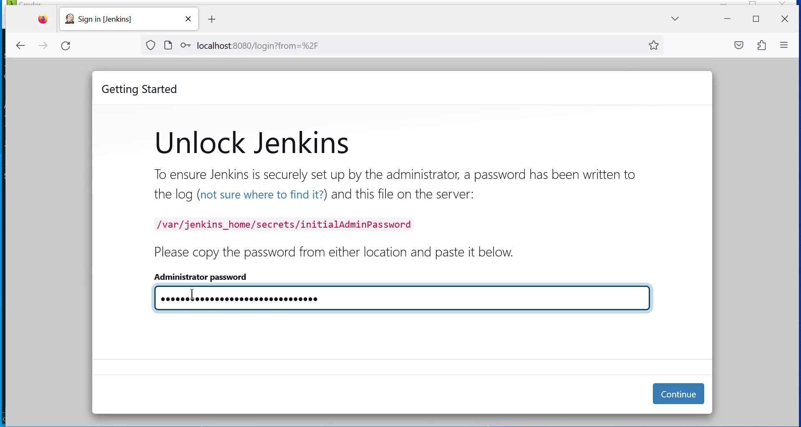
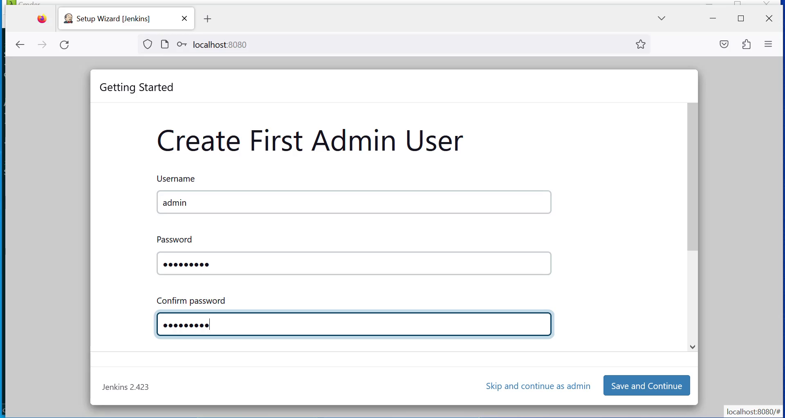
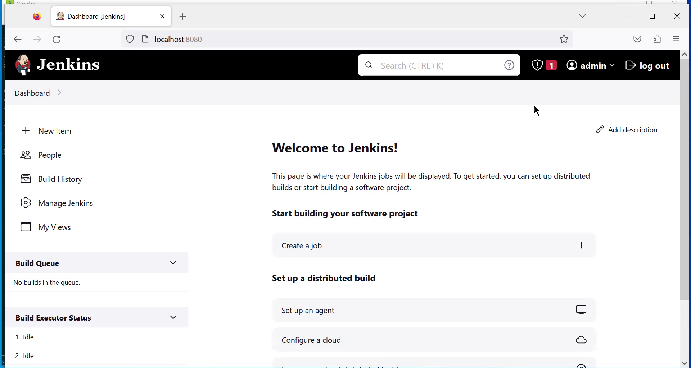

### Exercise 1: Installing Jenkins with Docker
###  Prerequisite
Docker container environment (i.e. actual version of Docker-Desktop) is mandatory.
### Tasks
The Jenkins image is available in the Docker Hub registry, so in order to install its latest version, 
we should execute the following command:
```
$ docker run -p <host_port>:8080 -v <host_volume>:/var/jenkins_home jenkins/jenkins
```
We need to specify the following parameters:

1. <code>host_port</code>: The port on which Jenkins is visible outside of the container.
2. <code>host_volume</code>: This specifies the directory where the Jenkins home is mapped. It needs to be specified as volume; therefore, it is persisted permanently because it contains the configuration, pipeline builds, and logs.


#### Sample installation procedure
1. Prepare the volume directory: We need a separate directory to keep the Jenkins data. 
```
$ mkdir $HOME/jenkins_home
```
2. Let's run the container as a daemon and give it a proper name with the following command:
```
$ docker run -d -p 8080:8080 \
-v $HOME/jenkins_home:/var/jenkins_home \
--name jenkins jenkins/jenkins

```

#### Initial configuration
1. Open Jenkins in the browser, at http://localhost:8080.
2. Jenkins will ask for the administrator password. It can be found in the Jenkins logs:
```
$ docker logs jenkins
...
Jenkins initial setup is required. An admin user has been 
created 
and a password generated.
Please use the following password to proceed to installation:
c50508effc6843a1a7b06f6491ed0ca6
...
```
[](img/01.png)
3. After accepting the initial password, Jenkins asks whether to install the suggested plugins, which are adjusted for the most common use cases. As the first Jenkins installation, it's reasonable to let Jenkins install all the recommended plugins.
4. After the plugin installation, Jenkins asks you to set up a username, password, and other basic information. If you skip it, the token from step 2 will be used as the admin password.

[](img/02.png)

5. The installation is then complete, and you should see the Jenkins dashboard:

[](img/03.png)

6. Test Jenkins with the "Hello World" pipeline
