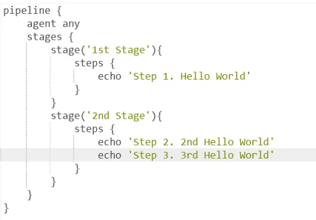

### Exercise 2: Multi-staged pipeline
####  Prerequisite
1. Docker container environment (i.e. actual version of Docker-Desktop) is mandatory.
2. You need a running Jenkins controller (master)
####  Tasks
1. For experiencing multi-stage and -step pipeline add a new item in Jenkins
2. You can use as blueprint the pipeline code below:

3. Build and see what result issues Jenkins on the console

