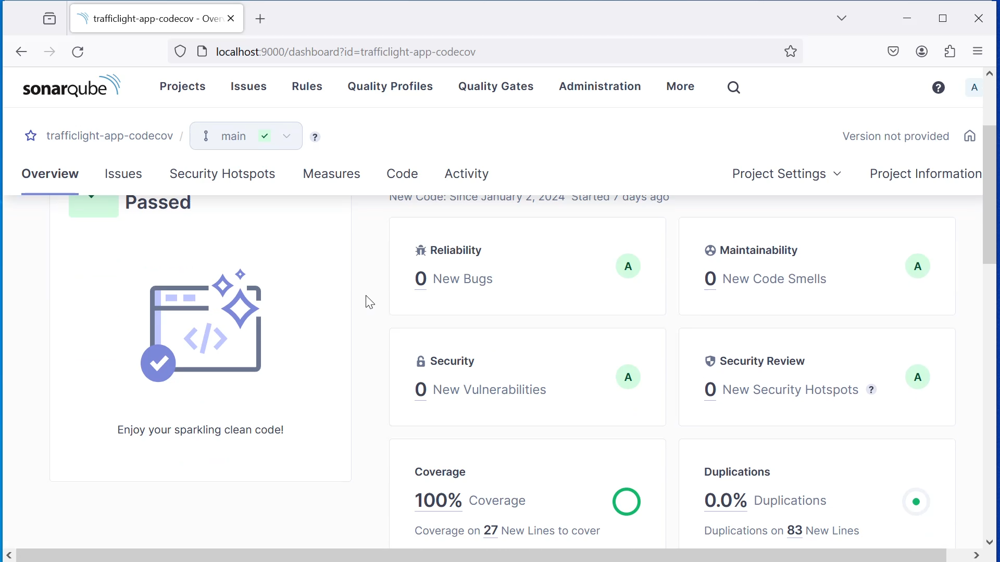

### Exercise 4: Code coverage for Traffic light API with SonarQube
###  Prerequisite
1. NodeJS is installed.
### Task: Create code coverage report with SonarQube
1. Download and install SonarQube. 
As reminder: Don't forget install the required Node packages from the package.json
2. Configure SonarQube according to ```sonar-project.properties```
3. Run code coverage test with jest, if not already done (see exercise 3).
4. Run now code coverage test with sonarqube. At the end of your terminal a
success message should be shown (see example below)
``` 
INFO: ANALYSIS SUCCESSFUL, you can find the results at: http://localhost:9000/dashboard?id=<your-project-key>
INFO: Note that you will be able to access the updated dashboard once the server has processed the submitted analysis report
INFO: More about the report processing at http://localhost:9000/api/ce/task?id=xyz
INFO: Analysis total time: 50.635 s
INFO: ------------------------------------------------------------------------
INFO: EXECUTION SUCCESS
INFO: ------------------------------------------------------------------------
INFO: Total time: 51.771s
INFO: Final Memory: 20M/80M
INFO: ------------------------------------------------------------------------
```
5. Examine your sonarqube report on in the browser. Check your
   improvements. As a goal you should come near (or better) to the result below.

[](img/01.png)
